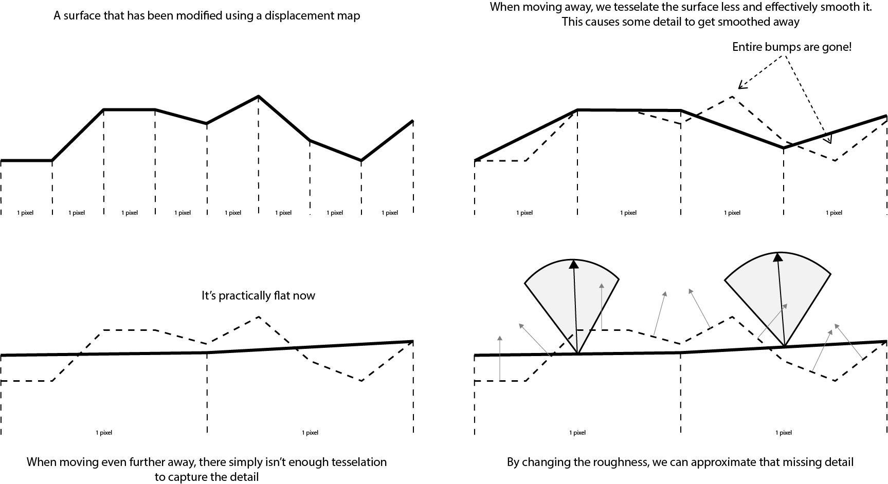
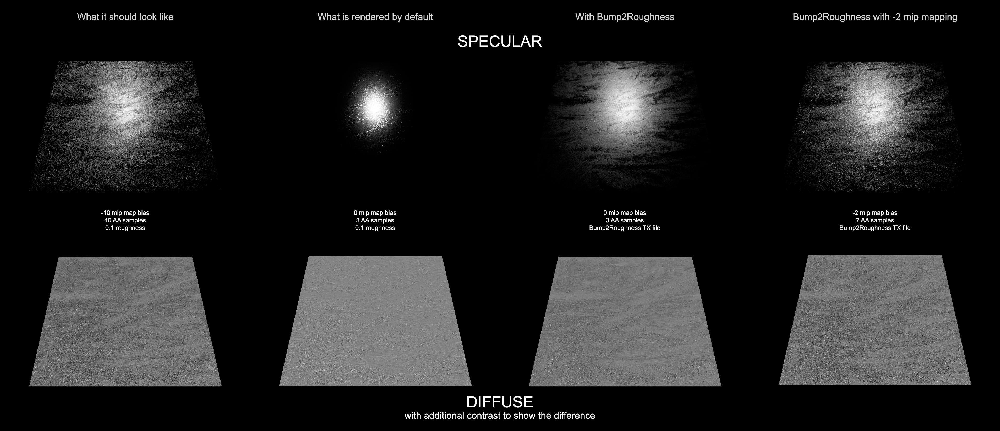

# Bump2Roughness
Bump2Roughness is my version of [Pixar's Geometry into Shading](https://graphics.pixar.com/library/BumpRoughness/). 
Bump2Roughness aims to provide more realistic shading by calculating the lost detail from mipmapping bump, normal 
and displacement maps and turns it into a roughness value for use in materials. Bump2Roughness differs from Geometry into Shading
since it makes use of TX and TEX files' ability to store precalculated mipmap layers to store the results in. All without having
the need for a plugin or shading node to do the calculations on-the-fly. The benefit is that it adds zero additional costs to
rendering (assuming you already have a roughness texture applied to your material), but at the downside of a small loss in accuracy.

## Why use Bump2Roughness?
In order to improve render times and aliasing, render engines make use of mipmapping for bump and normal maps and only tessellate
meshes to the size of a screen space pixel for displacement. While perfectly fine for diffuse colour and specular maps, it creates
problems for bump, normal and displacement maps. Mipmapping basically lowers the resolution of the texture based on the distance
from the camera, effectively smoothing and reducing details. This smoothing might not sound bad, but it causes the render engine
to produce wrong results and can make your renders look more fake and lacking detail. 
In order to get back that detail and get a correct image, you would have to turn off mipmapping by providing a large negative mipmap bias
and more heavily tessellating your meshes for displacement maps. This heavily increases render costs. However, this lost detail can be
approximated by the roughness parameter in materials, allowing you to still use mipmapping and keeping render times low.

Here you can see Bump2Roughness in action: 

## How does Bump2Roughness work?
Bump2Roughness takes in your bump, normal and displacement maps. Then it figures out the lost detail for each mipmap level and
calculates a roughness value to approximate that lost detail. This gives you multiple roughness textures. One for each mipmap level.
It then wraps those textures into an OIIO/Arnold TX or Renderman TEX texture file. When rendering, you plug the generated texture into
the roughness attribute on your material. The specific mathematics behind this can be found in [Pixar's Geometry into Shading](https://graphics.pixar.com/library/BumpRoughness/).

## Multiple roughness textures
If you already have a roughness texture, you can provide it as a base texture in Bump2Roughness. It will then add the calculated roughness
on top of that. Additionally, you can provide multiple bump, normal and displacement maps and the roughness values will be calculated separately
and added together to form one texture.

Adding multiple roughness values together is a little bit more complicated than doing a plus operation, but not that much more complicated.

```roughness_new = sqrt(roughness_a * roughness_a  +  roughness_b * roughness_b  +  roughness_c * roughness_c  +  ...)```

and you can keep adding as many as you want. Because of this, you could generate a roughness texture for each map individually and then
combine them in your shader graph, giving you more control.

## Diffuse roughness
Specular roughness is something that most people are aware of and would use. However, diffuse roughness also exists and in order to
get the more accuracy out of your image, you can also export a roughness texture for the diffuse lobe in your material. It wouldn't
have as much of an impact as specular roughness, but it can still make a difference.

## Usage in other places (like game engines)
Bump2Roughness generates OIIO/Arnold TX or Renderman TEX files and would generally be used with Arnold or Renderman. However, you can also
set the output mode to export individual image files for each mipmap level in the generated roughness texture. This would allow you to
load them into a game engine and set them as the different mipmap levels for a texture. Although it probably would be better to build
an automated tool that does this right into the game engine.

## maketx and txmake
In order to generate the texture files that house the roughness textures, Bump2Roughness uses OIIO's maketx or Renderman's txmake utility.
All you'd need is to tell the application where the executable is. It will also try to search for it on startup, so you could simply place
the executable right next to the jar file. Arnold also comes with a maketx utility, which is supposed to be the same as OIIO's maketx, but
for some reason it just doesn't work for me. I personally recommend using OIIO's maketx utility. You can get it on Windows by compiling it
using vcpkg (it's part of the tools segment of OpenImageIO).

## Future of Bump2Roughness
For me, this application is all that I'd need for my work. But, I am strongly aware that this is far from the best for many use cases.
While I most likely wouldn't be making many changes to this program in the future, I strongly encourage everyone to go create versions of
this that better fit different workflows. For those people, I have a list of things that I would implement if I were to ever rewrite this:
* Instead of using Java, rewrite it in C++ with OpenImageIO to read in the images. Java is just too limiting in regards to reading images.
* Make it fully command line and write the GUI as a separate application (could be in Java or even Python). Making it a command line utility would allow pipeline TDs to automate this and incorporate it in their pipelines.
* Add in the posibility to use anisotropy to increase the accuracy. The anisotropy value could the stored in one of the three channels next to the roughness value.